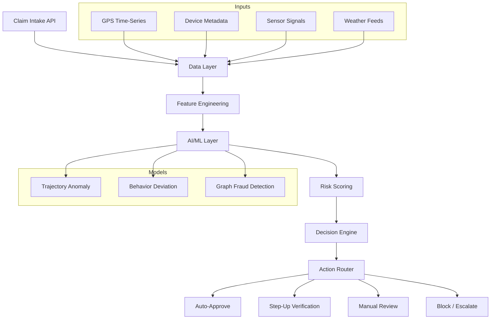
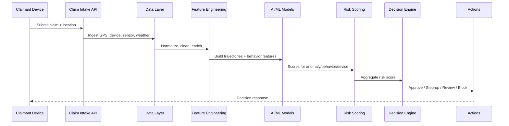
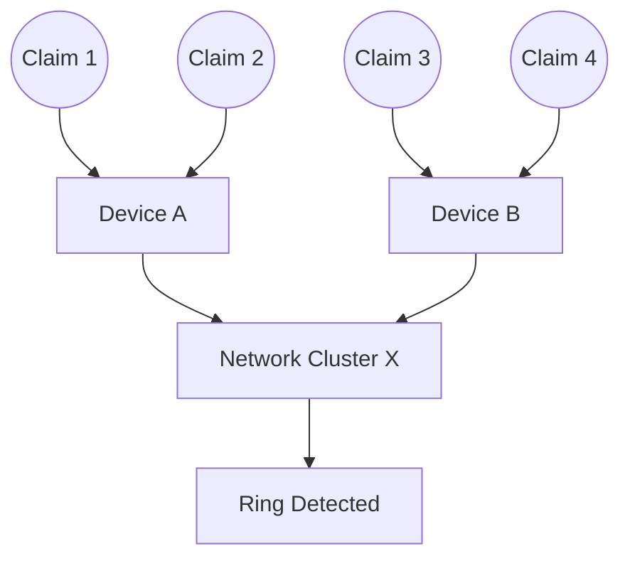
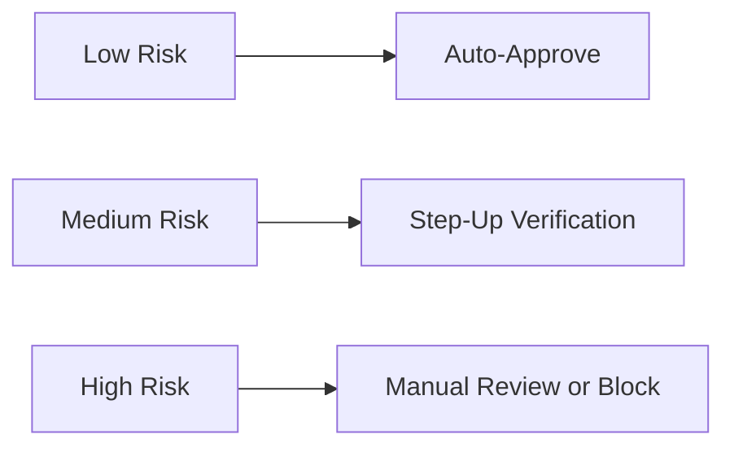

# SentinelAI

> AI-driven verification and fraud detection for parametric insurance platforms — built to challenge GPS claims instead of blindly trusting them.

Parametric insurance promises instant payouts during extreme events, but the foundation is shaky: GPS data is easy to spoof. SentinelAI verifies location claims intelligently, preserving speed while protecting platforms from coordinated, large-scale attacks.

---

## Why It Matters

Attackers can spoof GPS at scale and trigger payouts across thousands of fake claims. SentinelAI detects spoofed location data, abnormal movement, and coordinated fraud rings — so honest users get fast service and fraud gets blocked early.

---

## What It Does

- Distinguishes genuine vs. spoofed location claims
- Detects abnormal movement patterns and fake GPS signals
- Identifies coordinated fraud rings through group behavior
- Assigns real-time risk scores to claims
- Protects honest users while preventing large-scale financial exploitation

---

## System Architecture



---

## End-to-End Flow



---

## Core Pipeline Details

### 1) Data Layer
- GPS time-series
- Device metadata
- Sensor signals (accelerometer, gyroscope)
- Weather APIs

### 2) Feature Engineering
- Speed and acceleration profiles
- Trajectory consistency (path smoothness, teleport jumps)
- Behavioral baselines per device
- Environmental consistency (weather vs. motion)

### 3) AI/ML Layer
- Anomaly detection for unusual movement
- Sequence modeling for realistic trajectory validation
- Graph-based detection of coordinated fraud

### 4) Risk Scoring

```
Risk = w1 * A + w2 * B + w3 * C

A = trajectory anomaly
B = behavioral deviation
C = device/network risk
```

### 5) Decision Engine
- Classifies claims into low / medium / high risk
- Balances security with user experience

---

## Fraud Ring Detection (Graph View)



---

## Risk Decision Matrix



---

## Challenges We Ran Into

- Differentiating real anomalies (e.g., bad weather disruptions) from fraud
- Detecting coordinated attacks instead of isolated incidents
- Handling noisy and unreliable GPS data
- Staying strict on fraud without harming genuine users

---

## Accomplishments

- Built a multi-signal anti-spoofing strategy
- Detected fraud rings, not just individuals
- Balanced security with UX using risk-based decisions
- Designed for real-time, scalable deployment

---

## What We Learned

- GPS alone is not trustworthy
- Fraud detection requires pattern awareness over time
- Real-world systems must handle adversarial behavior
- Minimizing false positives is as hard as catching fraud

---

## What’s Next

- Deploy real-time ML pipelines
- Strengthen device fingerprinting and anti-emulator checks
- Introduce federated learning for privacy-aware improvements
- Stress-test against large-scale simulated attacks

---

## Team

Built with a focus on trust, speed, and fraud resilience.

---

## License

Add your license here.

---

## Quickstart (Dummy Working Project)

This repo includes a minimal FastAPI service that exposes a risk-scoring endpoint and a sample payload.

### Run Locally

```bash
python -m venv .venv
source .venv/bin/activate
pip install -r requirements.txt
uvicorn app.main:app --reload
```

### Test the API

```bash
curl -s http://127.0.0.1:8000/health
```

```bash
curl -s http://127.0.0.1:8000/claims/score \
  -H "Content-Type: application/json" \
  -d @data/sample_claim.json
```

### Output

Response includes `risk_score`, `risk_band`, and model factor breakdown.

---

## UI Demo

After starting the server, open:

```
http://127.0.0.1:8000/
```

You’ll see a lightweight web UI to paste a claim payload and score it.
